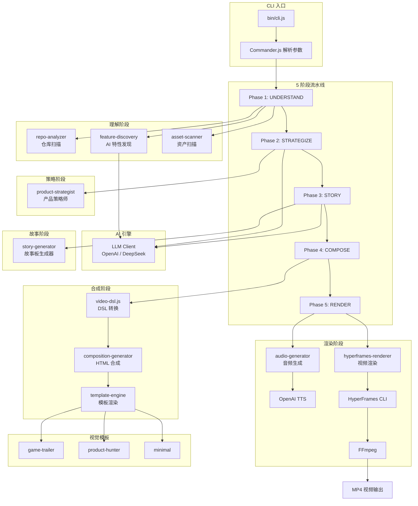

# Project2Video

> 一条命令，将任何 GitHub 项目变成 AI 驱动的宣传视频。

---

## 项目简介

Project2Video 是一个 AI 驱动的 CLI 工具，能够自动分析任意 GitHub 项目并生成高质量的宣传视频。它通过 **5 阶段智能流水线**（理解 → 策略 → 故事 → 合成 → 渲染），将代码仓库转化为 30-45 秒的专业级视频，适用于 Product Hunt 发布、社交媒体推广、项目展示等场景。

**核心理念**：开发者不需要视频编辑技能，只需指向一个项目目录，AI 会完成从分析到成片的全部工作。

## 核心能力

- **智能项目分析** — 自动扫描代码仓库，识别技术栈、项目类型、核心功能，提取关键代码片段
- **AI 特性发现** — 基于 LLM 深度分析代码，发现项目真正的核心价值和隐藏亮点
- **资产智能评估** — 自动扫描项目中的图片、视频、音频资源，评估质量并生成最优使用方案
- **营销策略生成** — AI 产品策略师分析目标用户画像，制定情感钩子和叙事角度
- **故事板编排** — AI 编剧自动生成 Hook → Reveal → Details → CTA 四幕结构的故事板
- **HTML 视频合成** — 将故事板转化为带 GSAP 动画的 HTML 时间线，支持多种视觉模板
- **TTS 语音旁白** — 集成 OpenAI TTS，自动生成专业旁白配音
- **一键视频渲染** — 通过 HyperFrames 将 HTML 合成渲染为 MP4 视频

## 效果展示

```
$ project2video ./my-awesome-project

  Phase 1: Understanding project...
  ✓ Repository analyzed: my-awesome-project (web-app)
  ✓ Discovered 5 core capabilities
  ✓ Assets scanned: score 72/100

  Phase 2: Building strategy...
  ✓ Strategy: "一行代码，搞定视频"

  Phase 3: Generating story...
  ✓ Story generated: 4 scenes, 8 shots

  Phase 4: Composing video...
  ✓ Timeline: 35s, 12 elements
  ✓ HTML composition generated

  Phase 5: Rendering...
  ✓ Audio generated
  ✓ Video rendered: output/my-awesome-project.mp4

  Done! Video saved to: output/my-awesome-project/renders/my-awesome-project.mp4
```

## 应用场景

| 场景 | 说明 |
|------|------|
| Product Hunt 发布 | 为新产品快速生成专业宣传视频 |
| 社交媒体推广 | Twitter/X、YouTube Shorts 等平台的项目展示 |
| 开源项目推广 | 让更多开发者了解你的项目价值 |
| 技术演示 | 会议演讲、技术分享的项目介绍素材 |
| 产品文档 | 项目首页的动态展示视频 |

## 系统架构



## 核心工作流程


## AI 工作流程

Project2Video 的 AI 系统由三个 LLM Agent 协同工作，每个 Agent 拥有独立的 System Prompt 和输出格式：

### Agent 1: Feature Discovery（特性发现）

- **输入**：仓库分析结果（技术栈、代码片段、文件结构）
- **职责**：超越 README 表面描述，从代码中发现项目真正的核心能力和隐藏特性
- **输出**：核心能力列表、用户价值、惊喜特性、竞品定位

### Agent 2: Product Strategist（产品策略师）

- **输入**：仓库分析 + 特性发现 + 资产清单
- **职责**：制定视频营销策略，确定目标用户画像、情感钩子、叙事角度
- **输出**：价值主张、情感钩子、故事角度、资产使用方案、模板推荐

### Agent 3: Story Generator（故事编剧）

- **输入**：全部前序分析结果
- **职责**：编写完整的视频故事板，包含场景、镜头、时长、资产使用、旁白
- **输出**：四幕结构故事板（Hook → Reveal → Details → CTA）


**LLM 配置**：支持 OpenAI 和 DeepSeek 两种 Provider，通过环境变量切换。所有 LLM 调用均使用 JSON Schema 输出格式，确保结构化数据的可靠性。

## 技术栈

| 层级 | 技术 | 用途 |
|------|------|------|
| 运行时 | Node.js >= 18 | ES Modules 支持 |
| CLI 框架 | Commander.js | 命令行参数解析 |
| AI 引擎 | OpenAI SDK | LLM 调用（兼容 DeepSeek） |
| 模板引擎 | Handlebars | HTML 模板渲染 |
| 图像处理 | Sharp | 图片元数据读取与质量评估 |
| 动画引擎 | GSAP | HTML 时间线动画 |
| 视频渲染 | HyperFrames | HTML → MP4 转换 |
| 视频编码 | FFmpeg | 底层视频编码 |
| TTS 语音 | OpenAI TTS | 旁白语音生成 |
| 终端美化 | Chalk + Ora | CLI 交互体验 |

## 项目结构

```
project2video/
├── bin/
│   └── cli.js                    # CLI 入口，Commander.js 命令定义
├── src/
│   ├── config.js                 # 全局配置（视频参数、资产评分权重、模板列表）
│   ├── pipeline.js               # 5 阶段流水线编排器
│   ├── llm/
│   │   └── client.js             # LLM 客户端（OpenAI/DeepSeek 双 Provider）
│   ├── understand/               # Phase 1: 理解阶段
│   │   ├── repo-analyzer.js      # 仓库扫描（技术栈、代码片段、项目类型推断）
│   │   ├── feature-discovery.js  # AI 特性发现 Agent
│   │   └── asset-scanner.js      # 资产扫描与质量评估
│   ├── strategize/               # Phase 2: 策略阶段
│   │   └── product-strategist.js # AI 产品策略师 Agent
│   ├── story/                    # Phase 3: 故事阶段
│   │   └── story-generator.js    # AI 故事板生成器 Agent
│   ├── compose/                  # Phase 4: 合成阶段
│   │   ├── video-dsl.js          # 故事板 → Video DSL 时间线转换
│   │   ├── composition-generator.js # HTML 合成文件生成
│   │   ├── template-engine.js    # 模板渲染引擎（DSL 元素 → HTML + GSAP）
│   │   └── template-loader.js    # 模板加载与缓存
│   └── render/                   # Phase 5: 渲染阶段
│       ├── audio-generator.js    # 音频生成（BGM + TTS 旁白）
│       └── hyperframes-renderer.js # HyperFrames 视频渲染
├── templates/                    # 视觉模板
│   ├── game-trailer/             # 游戏预告片风格（霓虹、快切、电影感）
│   ├── product-hunter/           # Product Hunt 风格（简洁、优雅、白色背景）
│   └── minimal/                  # 极简风格（深色背景、干净排版）
├── output/                       # 生成的视频输出目录
└── package.json
```

## 安装部署

### 前置要求

- **Node.js** >= 18
- **FFmpeg**（用于视频编码）
- **OpenAI API Key** 或 **DeepSeek API Key**（用于 AI 分析）

### 安装步骤

```bash
# 1. 克隆仓库
git clone https://github.com/guyue356/VideoGenerate.git
cd VideoGenerate/project2video

# 2. 安装依赖
npm install

# 3. 配置环境变量
cp .env.example .env
# 编辑 .env 文件，填入 API Key

# 4. 安装 HyperFrames（视频渲染引擎）
npx hyperframes init
```

### 环境变量配置

在项目根目录的 `.env` 文件中配置：

```bash
# LLM Provider: openai 或 deepseek
LLM_PROVIDER=deepseek

# API Keys（根据选择的 Provider 填写对应的 Key）
DEEPSEEK_API_KEY=sk-your-deepseek-key
OPENAI_API_KEY=sk-your-openai-key

# 可选：自定义 LLM 端点和模型
# LLM_BASE_URL=https://api.example.com/v1
# LLM_MODEL=deepseek-chat
```

## 快速开始

### 方式一：双击运行（推荐新手）

双击项目根目录的 `run.bat`，按提示操作即可。支持连续处理多个项目。

### 方式二：命令行

```bash
# 最简用法：指向一个项目目录
npx project2video ./path/to/your/project

# 指定模板
npx project2video ./my-project -t product-hunter

# 提供自定义素材目录
npx project2video ./my-project -a ./my-screenshots

# 只生成故事板（不渲染视频）
npx project2video ./my-project --story-only

# 快速模式（跳过 AI 分析，使用默认脚本）
npx project2video ./my-project --fast

# 自定义视频时长
npx project2video ./my-project --duration 40
```

## 使用说明

### 命令行参数

| 参数 | 说明 | 默认值 |
|------|------|--------|
| `<project-path>` | 项目目录路径（必填） | — |
| `-a, --assets <path>` | 自定义素材目录 | 自动扫描项目内 assets/ |
| `-t, --template <name>` | 视觉模板 | AI 自动推荐 |
| `-o, --output <path>` | 输出目录 | `output/<项目名>/` |
| `--no-tts` | 跳过 TTS 旁白，生成纯视觉版本 | false |
| `--story-only` | 只输出故事板 JSON，不渲染视频 | false |
| `--fast` | 快速模式，跳过 LLM Agent | false |
| `--preview` | 打开 HyperFrames Studio 预览 | false |
| `--duration <seconds>` | 目标视频时长（秒） | 35 |
| `-v, --verbose` | 显示详细的中间过程 JSON 数据 | false |
| `--save-intermediates` | 保存中间结果 JSON 文件到输出目录 | false |

### 视觉模板

| 模板 | 风格 | 适用项目 |
|------|------|----------|
| `game-trailer` | 霓虹视觉、快速剪辑、电影感 | 游戏项目 |
| `product-hunter` | 简洁优雅、白色背景、强调色 | Web 应用、SaaS 产品 |
| `minimal` | 深色背景、干净排版、微妙动画 | 通用，适合所有项目类型 |

### 输出结构

```
output/<project-name>/
├── compositions/
│   └── main.html          # HTML 合成文件（可在浏览器预览）
├── audio/
│   ├── bgm.wav            # 背景音乐
│   └── narration.mp3      # TTS 旁白（如启用）
├── renders/
│   └── <project-name>.mp4 # 最终视频
├── assets/
│   └── manifest.json      # 资产引用清单
├── intermediates/         # 使用 --save-intermediates 时生成
│   ├── 01-repo-profile.json
│   ├── 02-feature-discovery.json
│   ├── 03-asset-manifest.json
│   ├── 04-strategy.json
│   ├── 05-story.json
│   ├── 06-timeline.json
│   ├── 07-composition.json
│   └── 08-render-config.json
├── llm-logs.md            # LLM 调用日志（Prompt + Response）
├── index.html             # HTML 合成副本
└── hyperframes.json       # HyperFrames 项目配置
```

## 配置说明

### 资产评分权重

系统会自动评估项目中的素材质量（满分 100）：

| 素材类型 | 权重 | 说明 |
|---------|------|------|
| Demo 视频 | 30 | 最高权重，视频素材最具说服力 |
| Hero 图片 | 25 | 主视觉图片 |
| 细节截图 | 15 | 3 张以上截图获得加分 |
| CTA 素材 | 10 | 行动号召相关素材 |
| 自定义 BGM | 10 | 自定义背景音乐 |
| Logo | 10 | 项目 Logo |

### 项目类型自动识别

系统通过以下信号自动判断项目类型：

- **game**：Three.js/Phaser/Pixi 依赖，文件名含 "game"
- **web-app**：React/Vue/Svelte/Next.js 依赖，含 index.html
- **cli**：Commander.js/Yargs 依赖，文件名含 "cli"
- **api**：Express/Fastify/Hono 依赖，文件名含 "server"/"api"
- **library**：含 lib/ 目录且使用 TypeScript

## 调试与中间结果

查看视频生成的中间过程，便于调试和优化：

```bash
# 在控制台显示每个阶段的详细 JSON 数据
project2video ./my-project --verbose

# 将中间结果保存到文件（便于分析和对比）
project2video ./my-project --save-intermediates

# 只生成故事板，不渲染视频（快速查看 AI 生成的内容）
project2video ./my-project --story-only
```

使用 `--save-intermediates` 后，可以在 `output/<project>/intermediates/` 目录下查看：
- 仓库分析结果、AI 发现的核心特性
- 营销策略、完整故事板
- 时间线 DSL、HTML 合成配置

此外，每次运行都会自动生成 `llm-logs.md`，记录所有 LLM 调用的完整 Prompt 和 Response，便于调试 AI 生成质量。

## 性能与扩展性

- **快速模式**（`--fast`）：跳过所有 LLM 调用，使用规则引擎生成默认脚本，渲染时间 < 30 秒
- **标准模式**：3 次 LLM 调用（特性发现 + 策略 + 故事），总耗时约 1-2 分钟（取决于 LLM 响应速度）
- **模板缓存**：模板文件加载后缓存，避免重复读取
- **资产懒扫描**：仅扫描项目内常见的 assets/screenshots/images 目录

## 安全设计

- API Key 通过环境变量注入，不硬编码在代码中
- `.env` 文件已加入 `.gitignore`，防止密钥泄露
- LLM 输出经过 JSON Schema 验证，防止注入攻击
- 文件路径使用 `path.resolve()` 规范化，防止路径遍历

## 项目亮点

1. **AI 原生设计** — 不是简单的"代码转视频"，而是通过 3 个专业 AI Agent 协同工作，从代码中挖掘真正的项目价值
2. **零视频编辑技能要求** — 开发者只需指向项目目录，AI 完成从分析到成片的全部工作
3. **智能资产编排** — 自动评估素材质量，智能分配到 Hook/Reveal/Details/CTA 四个关键时刻
4. **Video DSL 抽象层** — 将视频元素抽象为声明式 DSL，支持多种模板引擎和渲染后端
5. **优雅降级** — 缺少素材时自动使用文字动画和代码片段填充，确保始终能输出视频
6. **双 LLM Provider** — 同时支持 OpenAI 和 DeepSeek，兼顾性能与成本

## Roadmap

- [ ] 支持更多视觉模板（科技风、手绘风、像素风）
- [ ] 支持自定义故事板编辑
- [ ] 支持多语言旁白
- [ ] 集成更多 TTS Provider（ElevenLabs、Azure TTS）
- [ ] 支持批量生成（一次为多个项目生成视频）
- [ ] Web UI 可视化编辑器
- [ ] 支持竖屏（9:16）视频输出
- [ ] 支持从 GitHub URL 直接分析

## 贡献指南

欢迎贡献代码、提交 Issue 或建议新功能！

```bash
# 1. Fork 本仓库
# 2. 创建特性分支
git checkout -b feature/amazing-feature

# 3. 提交更改
git commit -m "Add amazing feature"

# 4. 推送到远程
git push origin feature/amazing-feature

# 5. 创建 Pull Request
```

### 开发规范

- 使用 ES Modules（`import/export`）
- 遵循现有代码风格
- 新增模板需包含 `manifest.json`、`template.html`、`style.css`、`animations.js`
- LLM Prompt 修改需测试 JSON 输出格式的稳定性

## FAQ

**Q: 支持哪些编程语言的项目？**
A: 理论上支持所有语言。系统通过文件扩展名和依赖配置自动识别，对 JavaScript/TypeScript/Python 项目支持最佳。

**Q: 没有 API Key 可以使用吗？**
A: 可以使用 `--fast` 模式，跳过所有 AI 分析，使用规则引擎生成默认脚本。

**Q: 视频分辨率是多少？**
A: 默认 1920x1080（16:9），30fps。竖屏支持在 Roadmap 中。

**Q: 可以自定义背景音乐吗？**
A: 可以。将音频文件放在项目的 assets 目录中，系统会自动识别并使用。

**Q: 渲染失败怎么办？**
A: 系统会回退到输出 HTML 合成文件，你可以在浏览器中打开预览，然后使用其他工具录屏。

## License

[MIT License](LICENSE) - Copyright (c) 2026 guyue356
